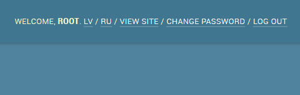

# django-admin-multilang
A very simple Django application that adds the ability on the admin page to select a language manually.

<h3>How to install</h3>
<ul>
  <li>
      Install using pip:
    
        pip install django-admin-multilang
       
  </li>
</ul>

<h3>How to configure</h3>
<ul>
  <li>
    Add package to INSTALLED_APPS (above of django.contrib.admin):
  
        INSTALLED_APPS = [
          'admin_multilanguage',
          'django.contrib.admin',
          'django.contrib.auth',
          'django.contrib.contenttypes',
          'django.contrib.sessions',
          'django.contrib.messages',
          'django.contrib.staticfiles',
          ...
      ]
  
  </li>
  <li>
    Add to urlpatterns.py, where is located settings.py, this followed line:
  
        urlpattern += [
            path('', include('admin_multilanguage.urls', namespace="admin_multilanguage")),
        ]
  </li>
  
  <li>
    Configure in settings.py which languages you want to support (Example):
    
        from django.utils.translation import ugettext_lazy as _
        LANGUAGES = (
            ('lv', _("Latvian")),
            ('en', _("English")),
            ('ru', _("Russian")),
        )
        
        # language to select by default
        LANGUAGE_CODE = 'en'
  </li>
</ul>

PROFFIT!
